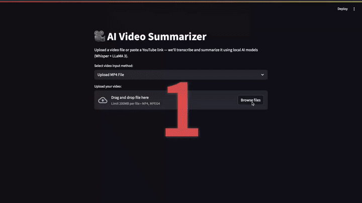

# AI Video Summarizer

A local tool that **transcribes and summarizes videos** using open-source AI models like **Whisper** and **LLaMA 3** — all wrapped in a clean **Streamlit interface**.

---

## Features

- Upload or paste a **YouTube link**
- Extracts and transcribes audio using **Faster-Whisper**
- Summarizes transcripts using **LLaMA 3 (via Ollama)**
- Fast, local-first, works offline once models are set up
- Easy interface using **Streamlit**
- Downloadable transcript and summary files

---

## Demo



---

## Tech Stack

- [Streamlit](https://streamlit.io/) – UI framework
- [Faster-Whisper](https://github.com/guillaumekln/faster-whisper) – transcription
- [LLaMA 3 via Ollama](https://ollama.com/) – text summarization
- [MoviePy](https://zulko.github.io/moviepy/) – audio extraction
- [yt-dlp](https://github.com/yt-dlp/yt-dlp) – YouTube video downloading
- Python

---

## Installation

```bash
# Clone the repo
git clone https://github.com/Shashankk002/AI-video-summarizer.git
cd AI-video-summarizer.git

# (Recommended) Create a virtual environment
python3 -m venv venv
source venv/bin/activate  # On Windows: venv\Scripts\activate

# Install required packages
pip install streamlit moviepy yt-dlp faster-whisper

# Optional (for summarization)
 Make sure Ollama and LLaMA 3 are installed:
https://ollama.com/library/llama3

# Run the app
streamlit run app.py
